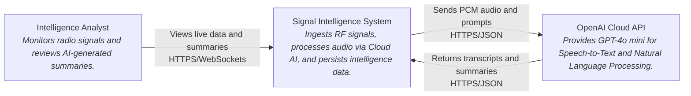
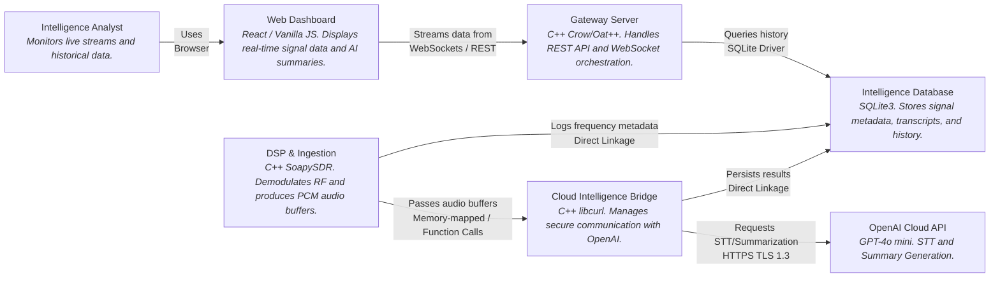

**System Context Diagram**

```mermaid
flowchart LR
    %% Nodes
    user["Intelligence Analyst<br><i>Monitors radio signals and reviews AI-generated summaries.</i>"]
    signalSystem["Signal Intelligence System<br><i>Ingests RF signals, processes audio via Cloud AI, and persists intelligence data.</i>"]
    openai["OpenAI Cloud API<br><i>Provides GPT-4o mini for Speech-to-Text and Natural Language Processing.</i>"]

    %% Relationships
    user -->|Views live data and summaries<br>HTTPS/WebSockets| signalSystem
    signalSystem -->|Sends PCM audio and prompts<br>HTTPS/JSON| openai
    openai -->|Returns transcripts and summaries<br>HTTPS/JSON| signalSystem
```

**Container Diagram**

```mermaid
flowchart LR
    %% Nodes
    user["Intelligence Analyst<br><i>Monitors live streams and historical data.</i>"]

    web_app["Web Dashboard<br><i>React / Vanilla JS. Displays real-time signal data and AI summaries.</i>"]
    gateway["Gateway Server<br><i>C++ Crow/Oat++. Handles REST API and WebSocket orchestration.</i>"]
    dsp_engine["DSP & Ingestion<br><i>C++ SoapySDR. Demodulates RF and produces PCM audio buffers.</i>"]
    ai_bridge["Cloud Intelligence Bridge<br><i>C++ libcurl. Manages secure communication with OpenAI.</i>"]
    sqlite["Intelligence Database<br><i>SQLite3. Stores signal metadata, transcripts, and history.</i>"]
    openai["OpenAI Cloud API<br><i>GPT-4o mini. STT and Summary Generation.</i>"]

    %% Relationships
    user -->|Uses<br>Browser| web_app
    web_app -->|Streams data from<br>WebSockets / REST| gateway
    dsp_engine -->|Passes audio buffers<br>Memory-mapped / Function Calls| ai_bridge
    ai_bridge -->|Requests STT/Summarization<br>HTTPS TLS 1.3| openai
    ai_bridge -->|Persists results<br>Direct Linkage| sqlite
    gateway -->|Queries history<br>SQLite Driver| sqlite
    dsp_engine -->|Logs frequency metadata<br>Direct Linkage| sqlite
```